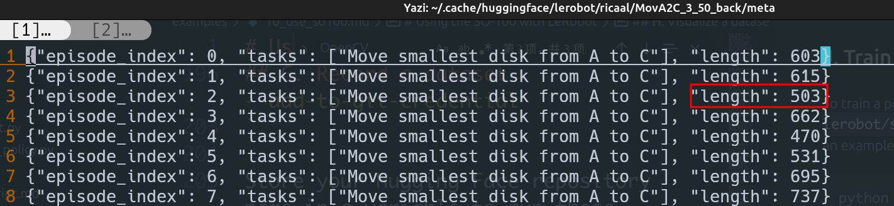
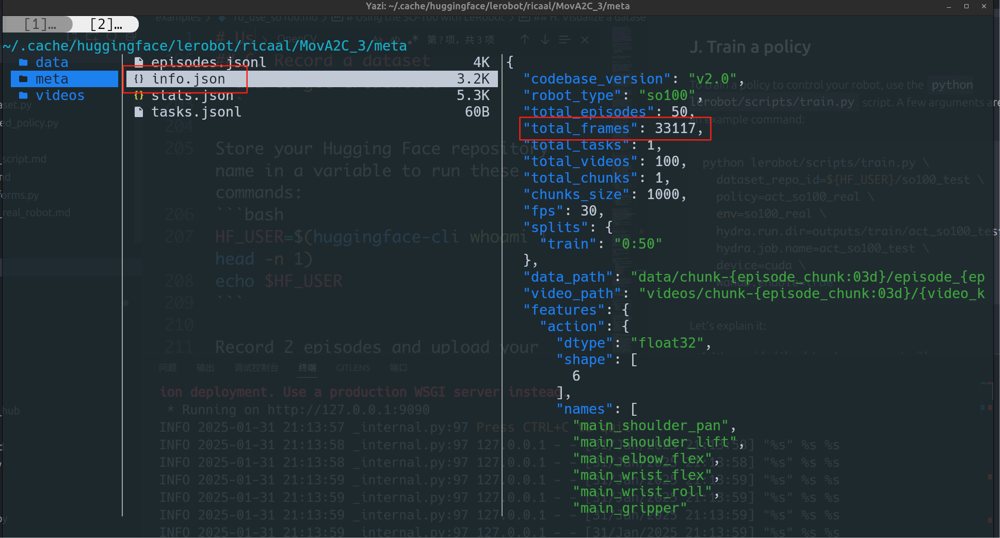
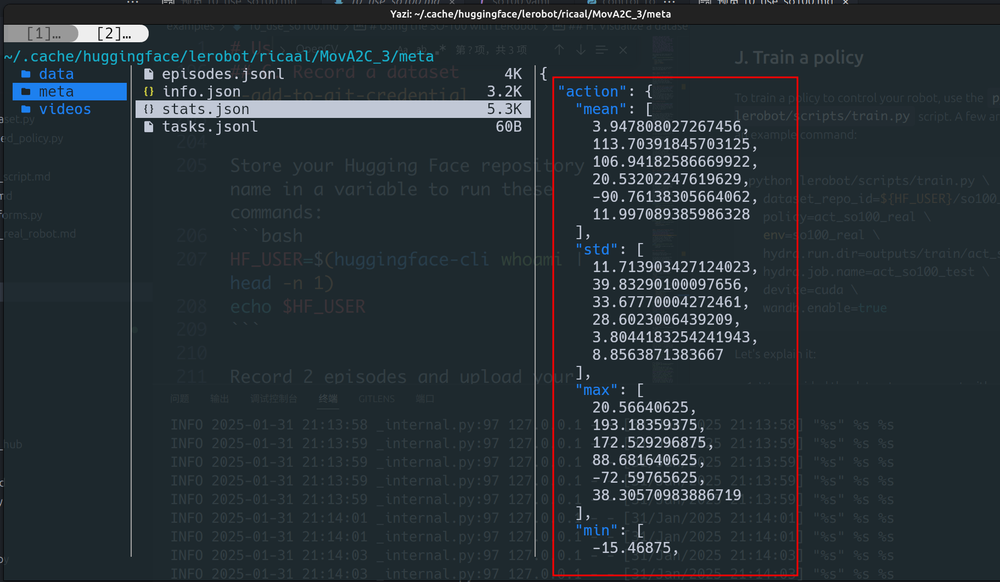

可以用我克隆修改后的项目代码，做下面对应完全离线采集数据、替换数据、训练的步骤

也可以参照 [07. 离线训练更改细节.md](<07. 离线训练更改细节.md>) 来实现不上传huggingface、从huggingface下载数据这一步


# 1. 测试接口

## a. 舵机

```
python lerobot/scripts/find_motors_bus_port.py
```

## b. 相机

```
python lerobot/common/robot_devices/cameras/opencv.py \
    --images-dir outputs/images_from_opencv_cameras
```


# 2. 摇操作测试

## a. 不用相机

```
python lerobot/scripts/control_robot.py teleoperate \
    --robot-path lerobot/configs/robot/so100.yaml \
    --robot-overrides '~cameras' \
    --display-cameras 0
```

## b. 用相机

```
python lerobot/scripts/control_robot.py teleoperate \
    --robot-path lerobot/configs/robot/so100.yaml
```

# 3. 数据采集

**（千万注意：听到语音提示完成后才动机械臂摇操！！！）**


任务名称

```
TASK_NAME=MovA2C_3
```


登陆 huggingface（目的是设定 HF_USER 变量）
不登陆的话就运行 `HF_USER=XXXXX`

```
huggingface-cli login --token ${HUGGINGFACE_TOKEN} --add-to-git-credential
HF_USER=$(huggingface-cli whoami | head -n 1)
echo $HF_USER
```


## a. 要上传数据到huggingface

```
python lerobot/scripts/control_robot.py record \
    --robot-path lerobot/configs/robot/so100.yaml \
    --fps 30 \
    --repo-id ${HF_USER}/${TASK_NAME} \
    --tags so100 tutorial \
    --warmup-time-s 5 \
    --episode-time-s 40 \
    --reset-time-s 5 \
    --num-episodes 50 \
    --push-to-hub 1 \
    --single-task "Move smallest disk from A to C"
```

可视化

```
python lerobot/scripts/visualize_dataset_html.py \
  --repo-id ${HF_USER}/${TASK_NAME}
```

------


## b. 不上传数据到huggingface

**`--push-to-hub 0` 禁用上传**

```
python lerobot/scripts/control_robot.py record \
    --robot-path lerobot/configs/robot/so100.yaml \
    --fps 30 \
    --repo-id ${HF_USER}/${TASK_NAME} \
    --tags so100 tutorial \
    --warmup-time-s 5 \
    --episode-time-s 40 \
    --reset-time-s 5 \
    --num-episodes 50 \
    --push-to-hub 0 \
    --single-task "Move middle disk from A to B"
```

可视化

```
python lerobot/scripts/visualize_dataset_html.py \
  --repo-id ${HF_USER}/${TASK_NAME} \
  --root ~/.cache/huggingface/lerobot/${HF_USER}/${TASK_NAME} \
  --local-files-only 1
```


# 4. 回放测试

在线版本

```
python lerobot/scripts/control_robot.py replay \
    --robot-path lerobot/configs/robot/so100.yaml \
    --fps 30 \
    --repo-id ${HF_USER}/${TASK_NAME} \
    --episode 0
```

离线版本

```
python lerobot/scripts/control_robot.py replay \
    --robot-path lerobot/configs/robot/so100.yaml \
    --fps 30 \
    --repo-id ${HF_USER}/${TASK_NAME} \
    --local-files-only 1 \
    --episode 0
```


# 5. 数据替换

任务名称

```
TASK_NAME=MovA2C_3
```


## a. 打开数据位置

```
yazi ~/.cache/huggingface/lerobot/${HF_USER}/${TASK_NAME}
```

或删除源数据

```
rm -rf ~/.cache/huggingface/lerobot/${HF_USER}/${TASK_NAME}
```


## b. 替换元数据

```
data/chunk-000/episode_xxxxxx.parquet (重命名再移过来)

videos/chunk-000 里面子文件的 mp4文件
```


## c. 修改统计参数

关键`.parquet` 和 `meta/episodes.jsonl `里的 `length` 要一一对应



下面这也许是length的总和，对应加减 




## d. 重新计算统计量 

（新写的文件**`ReConsolidate.py`**）

```
python lerobot/scripts/ReConsolidate.py --dataset_repo_id ${HF_USER}/${TASK_NAME}
```



**重新计算结果在 ` /meta/stats.json`**

# 6. 开始训练

登陆可视化工具  [apikey网站](https://wandb.ai/authorize)

```
wandb login
```

任务名称

```
TASK_NAME=MovA2C_3
```


## a. 要从 huggingface 下载数据

```
python lerobot/scripts/train.py \
  dataset_repo_id=${HF_USER}/${TASK_NAME} \
  policy=act_so100_real \
  env=so100_real \
  hydra.run.dir=outputs/train/act_so100_test \
  hydra.job.name=act_so100_test \
  device=cuda \
  wandb.enable=true
```


## b. 不从 huggingface 下载数据

```
python lerobot/scripts/train_offline.py \
  dataset_repo_id=${HF_USER}/${TASK_NAME} \
  policy=act_so100_real \
  env=so100_real \
  hydra.run.dir=outputs/train/act_so100_test \
  hydra.job.name=act_so100_test \
  device=cuda \
  wandb.enable=true
```


# 7. 终止 & 恢复训练

` resume=true \` （不从 huggingface 下载数据）

```
python lerobot/scripts/train_offline.py \
    dataset_repo_id=${HF_USER}/${TASK_NAME} \
    policy=act_so100_real \
    env=so100_real \
    hydra.run.dir=outputs/train/act_so100_test \
    hydra.job.name=act_so100_test \
    device=cuda \
    wandb.enable=true \
    resume=true
```


# 8. 验证训练结果

更新符号连接！！！

（注意不能rm -rf  可能不安全）

（注意更新 软连接要删了再新建，不能重复调用 ln -s，这样改不了）

```
rm last
```

```
ln -s 080000 last
```

删除测试文件夹

```
rm -rf ~/.cache/huggingface/lerobot/${HF_USER}/eval_${TASK_NAME}
```

开始测试

```
python lerobot/scripts/control_robot.py record \
  --robot-path lerobot/configs/robot/so100.yaml \
  --fps 30 \
  --repo-id ${HF_USER}/eval_${TASK_NAME} \
  --tags so100 tutorial eval \
  --warmup-time-s 5 \
  --episode-time-s 30 \
  --reset-time-s 5 \
  --num-episodes 10 \
  --push-to-hub 0 \
  --single-task "Eval: Move smallest disk from A to C" \
  -p outputs/train/Task_${TASK_NAME}/checkpoints/last/pretrained_model
```

可视化

```
python lerobot/scripts/visualize_dataset_html.py \
  --repo-id ${HF_USER}/${TASK_NAME} \
  --root ~/.cache/huggingface/lerobot/${HF_USER}/eval_${TASK_NAME} \
  --local-files-only 1
```

